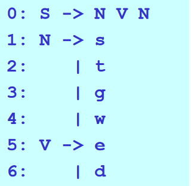
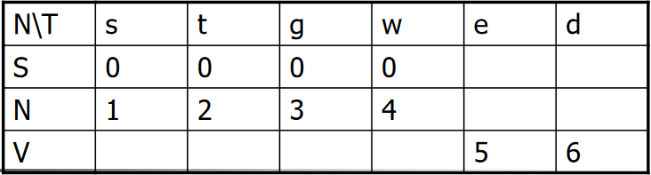
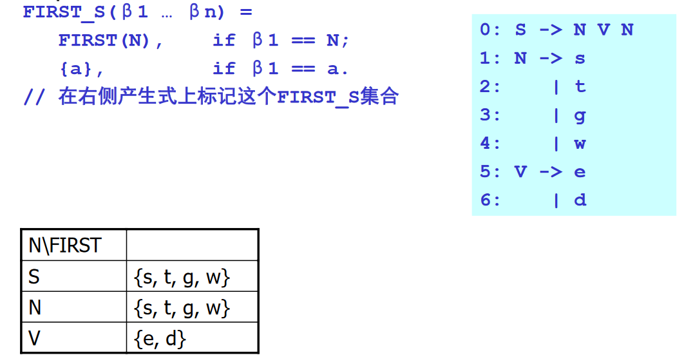
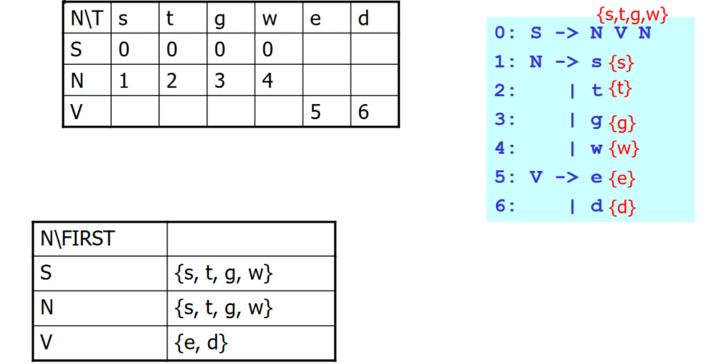
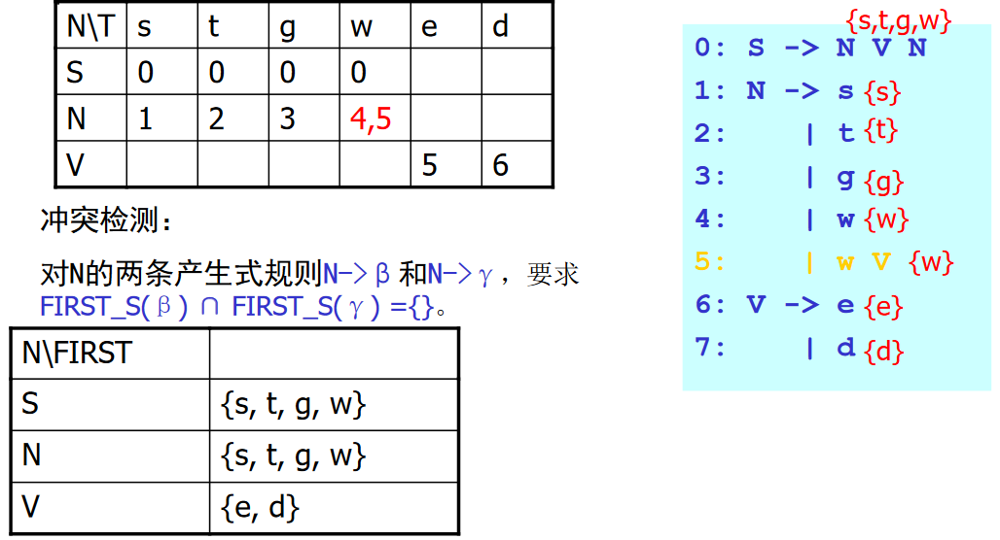
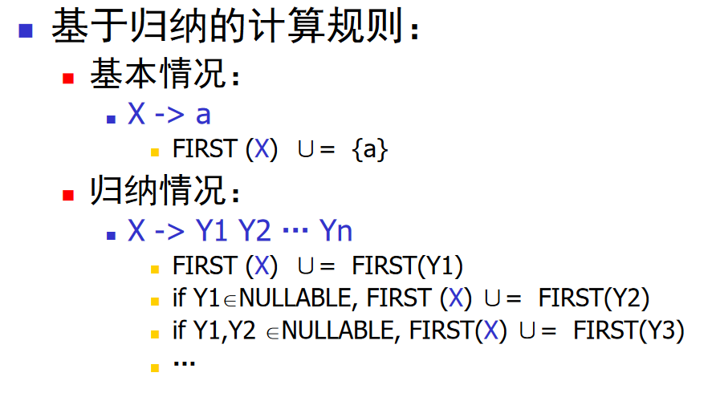
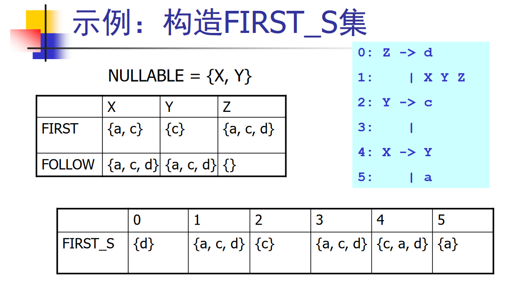
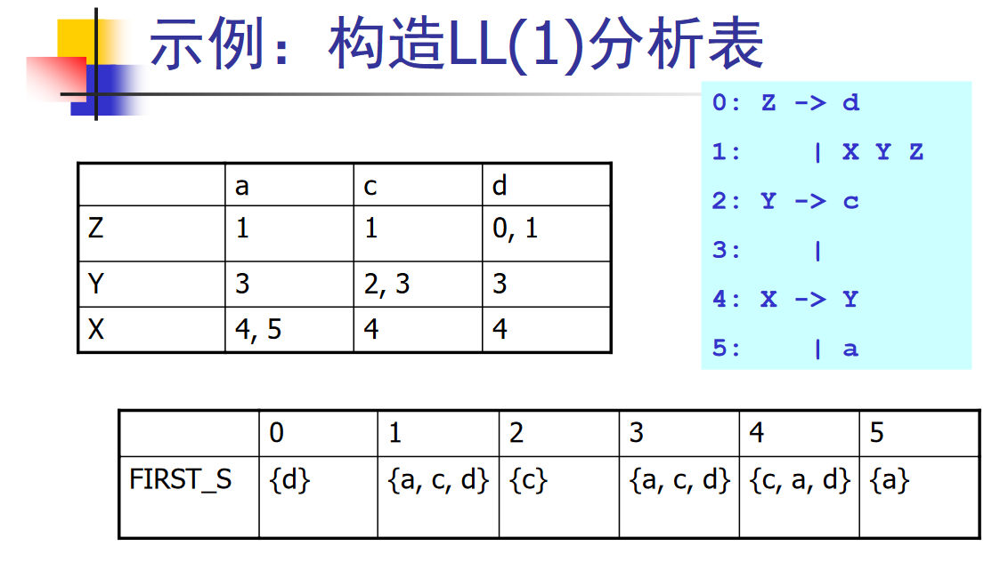

## 语法分析(Syntax Analysis)的任务

分析的任务是**确定程序的语法，或称作结构**，也正是这个原因，它又被称作**语法分析（syntax analysis）**。程序设计语言的语法通常是由**上下文无关（context-free grammar）**的**文法规则（grammar rule）**给出，其方式同扫描程序识别的由正则表达式提供的记号的词法结构相类似。上下文无关文法的确利用了与正则表达式中极为类似的命名惯例和运算。二者的主要区别在于上下文无关文法的规则是**递归的（recursive）**。例如一般来说，if 语句的结构应允许其中可嵌套其他的 if 语句，而在正则表达式中却不能这样做。这个区别造成的影响很大。由上下文无关文法识别的结构类比由正则表达式识别的结构类大大增多了。用作识别这些结构的算法也与扫描算法差别很大，这是因为它们必须使用递归调用或显式管理的分析栈。用作表示语言语义结构的数据结构现在也必须是递归的，而不再是线性的（如同用于词法和记号中的一样）了。经常使用的基本结构是一类树，称作**分析树（parse tree）**或**语法树（syntax tree）**。


输入记号流，语法规则，输出抽象语法树(分析语法错误也是这部分职责)


## 上下文无关文法

**context-free grammar**，描述语法规则的数学工具


上下文无关文法说明程序设计语言的语法结构。除了上下文无关文法涉及到了递归规则之外，这样的说明与使用正则表达式的词法结构的说明十分类似：
$$
exp \to exp\  op\  exp |(exp)|number \\
op\to +|-|*
$$


同正则表达式类似，文法规则是定义在一个字母表或符号集之上。在正则表达式中，这些符号通常就是字符，而在文法规则中，符号通常是表示字符串的记号。选择并置操作与正则表达式一样，但是重复操作使用递归表示，而不是像正则那样$a^*$表示。箭头符号“→”来表示名字的定义


 **上下文无关文法**是四元组$G(V_T,V_N,S,P)$：


* $V_T$：终结符集合
* $V_N$：非终结符集合
* $S$：开始符号，非终结符中的一个
* $P$：产生式集合，产生式形式：$A\to\alpha$


**推导**：


* 给定文法$G$，从G的开始符号S开始，用产生式的右部替换左侧的**非终结符**
* 不断重复，直到不出现**非终结符**为止
* 最终的串称为**句子**


**最左推导**：每次总是选择最左侧的符号进行替换


**最右推导**：每次总是选择最右侧的符号进行替换


## 分析树与抽象语法树

推导 为 构造 来自一个初始的非终结符的特定终结符的串 提供了一个办法，但是推导并未唯一地表示出它们所构造的结构。总而言之，对于同一个串可有多个推导。
$$
exp \to exp\  op\  exp |(exp)|number \\
op\to +|-|*
$$
对于上面的文法，我们构造出记号串 $(numver\ -\ number)\ *\ number$，下面两种推导都可以


$$
exp \Rightarrow exp\ op\ exp\\
\Rightarrow exp\ op\ number\\
\Rightarrow exp\ *\ number\\
\Rightarrow (exp)\ *\ number\\
\Rightarrow (exp\ op\ exp)\ *\ number\\
\Rightarrow (exp\ op\ number)\ *\ nummber\\
\Rightarrow (exp\ -\ number)\ *\ nummber\\
\Rightarrow (number\ -\ number)\ *\ nummber\\
$$


$$
exp \Rightarrow exp\ op\ exp\\
\Rightarrow (exp)\ op\ exp\\
\Rightarrow (exp\ op\ exp)\ op\ exp\\
\Rightarrow (number\ op\ exp)\ op\ exp\\
\Rightarrow (number\ -\ exp)\ op\ exp\\
\Rightarrow (number\ -\ number)\ op\ exp\\
\Rightarrow (number\ -\ number)\ *\ exp\\
\Rightarrow (number\ -\ number)\ *\ number\\
$$


二者唯一的差别在于提供的替换顺序，而这其实是一个很表面的差别。为了把它表示得更清楚一些，我们需要表示出终结符串的结构，而这些终结符将推导的主要特征抽取出来，同时却将表面的差别按顺序分解开来。这样的表示法就是树结构，它称作**分析树**。


一个例子：推导与**分析树**


**抽象语法树**：

分析树是表述记号串结构的一种十分有用的表示法。在分析树中，记号表现为分析树的树叶（自左至右），而分析树的内部节点则表示推导的各个步骤（按某种顺序）。但是，分析树却包括了比纯粹为编译生成可执行代码所需的更多的信息。为了看清这一点，可根据简单的表达式文法，考虑表达式 $3 + 4$ 的分析树：


实际上可将这个树看作：根代表两个孩子 $exp$子树的数值相加。而另一方面，每个子树又代表它的每个 $number$孩子的值。但是还有一个更为简单的方法能表示与这相同的信息，即如树：


例2：$(34-2)*42$


在这个树中，括号记号实际已消失了，但它仍然准确地表达着从 34中减去3，然后再乘以42的语义内容。


这种树是真正的源代码记号序列的抽象表示。虽然不能从其中重新得到记号序列（不同于分析树），但是它们却包含了转换所需的所有信息，而且比分析树效率更高。这样的树称作**抽象语法树（abstract syntax tree）**或简称为**语法树（syntax tree）**。


一般树的含义取决于后序遍历，这会引出二义性文法


## 二义性文法

给定文法 $G$，如果存在句子 $s$，他有两颗不同的分析树，那么称 $G$ 为二义性文法。（因为如果树结构不同，那么后续遍历结果肯定不同，产生歧义）


解决方案：**重写**，具体问题具体分析，没有统一方法


二义性文法认为是一种语言语法的不完善说明，而且也应避免它。产生根本原因是文法中缺少对文法符号优先级和结合性的规定。


改写二义性闻法得关键步骤

* 一如一个新的非终结符，增加一个子结构，并提高一级优先级
* 递归非终结符在终结符左边，使该终结符具有左结合性，反之是右结合


## 自顶向下的分析

语法分析：给定文法$G$和句子$s$，回答$s$能否从$G$推导出来？（也就是输入是否合法）


基本算法思想：从$G$的开始符号出发，随意推导出某个句子$t$，比较$t$和$s$，相等回答yes，否则?(回溯，继续)，其实就等同于在树上做回溯遍历(一般是后序)


因为这是从开始符号出发推导出句子，因此称为**自顶向下分析**


回溯非常费时，我们需要线性时间的算法

* 避免回溯
  * 用前看符号避免回溯，选择产生式时候，看一眼输入的串当前该匹配哪个符号，找到准确路线(会有多个路线如何选择的问题)
* **引出递归下降分析算法**和**LL(1)分析算法**

### 递归下降分析算法

* 也称为预测分析
* 分析高效(线性时间)
* 容易实现(方便手工编码)
* 错误定位和诊断信息准确
* 被很多编译器采用：GCC4.0，LLVM ...


算法基本思想：分治

* 每个非终结符构造一个分析函数
* 用**前看符号**指导产生式规则的选择


### LL(1)分析算法

分析算法规范后，可以利用算法自动生成语法分析器的代码：比如一些工具

* ANTLR
* YACC
* bison


**LL(1)**分析算法：

* 从**左(L)**向右读入程序，最**左(L)**推导，采用**一个(1)**前看符号(用未读入的符号做辅助)
  * 分析高效(线性时间)
  * 错误定位和诊断信息准确
  * 有很多开源或商业生成工具：ANTLR...
* 基本思想：表驱动的分析算法


#### LL(1)分析的基本方法：


LL(1)分析使用**显式栈**而不是递归调用来完成分析。


如文法：$S\to(S)S|\varepsilon$ ，一个匹配成对括号的文法，假设我们的输入串是`"()"`

|      | 分析栈      | 输入  |       动作        |
| :--: | :---------- | :---: | :---------------: |
|  1   | `$ S`       | `()$` |    $S\to(S)S$     |
|  2   | `$ S ) S (` | `()$` |       匹配        |
|  3   | `$ S ) S`   | `)$`  | $S\to\varepsilon$ |
|  4   | `$ S )`     | `)$`  |       匹配        |
|  5   | `$ S`       |  `$`  | $S\to\varepsilon$ |
|  6   | `$`         |  `$`  |       接受        |

* 分析栈里的`$`表示栈底部，输入里的`$`表示串结束
* 1) 利用文法选择$A→α$将栈顶部的非终结符$A$替换成串$α$。
  2) 将栈顶部的记号与下一个输入记号匹配

对于上面的例子：

* 初始，栈顶为`S`，输入`()`
* 选择用来替换栈顶`S`的规则是$S\to(S)S$，所以将串`S)S(`压入栈,，（注意顺序是反向的，这样出栈顺序是`(S)S`）
* 发现栈顶的`(`和输入串`(`匹配，弹出，继续
* 栈顶又变成`S`，用$S\to\varepsilon$替换，即空串替换，仅弹出`S`
* 发现栈顶的`)`和输入串`)`匹配，弹出，继续
* 栈顶又变成`S`，用$S\to\varepsilon$替换，即空串替换，仅弹出`S`
* 栈为空，接收
* 

这个过程与串`()`最左推导的步骤完全对应：


$$
S\Rightarrow (S)S  \ ,\ \ [S\to(S)S] \\
\Rightarrow ()S\ , \ \ [S\to\varepsilon]\\
\Rightarrow ()\ ,\ \ [S\to\varepsilon]
$$


如果要在分析进行时构造一个分析树，则可当将每个非终结符或终结符**压入到栈**中时添加节点来构造动作。


#### 表驱动(分析表)

当**非终结符A**位于分析栈的顶部时，根据当前的输入记号（前看），必须使用刚刚描述过的分析办法做出一个决定：当替换栈中的 A时应为A**选择哪一个文法规则**，相反地，当记号位于栈顶部时，就无需做出这样的决定。


通过构造一个LL(1)分析表(LL(1) parsing table)就可以表达出可能的选择。


这样的表格基本上是一个由非终结符和终结符索引的二维数组，其中非终结符和终结符包括了要在恰当的分析
步骤（包括代表输入结束的`$`）中使用的产生式选择。这个表被称为**M[N, T]**，这里的N是文法的非终结符的集合， T是终结符或记号的集合M可被认为是“运动的”表。


我们假设表 **M[N, T]**在开始时，它的所有项目均为空。任何在构造之后继续为空的项目都代表了在分析中可能发生的潜在错误。根据以下规则在这个表中添加产生式：

* 1）如果$A\to\alpha$是一个产生式选择,且有推导$\alpha\Rightarrow\ ^*a\beta$成立，其中$a$是一个记号，则添加到表中
* 2）如果$A→α$是一个产生式选择，且有推导$α ⇒ \ ^∗\varepsilon$ 和$S \$ ⇒ \ ^∗βAaγ $成立，其中S是开始符号，
  $a$是一个记号（或`$`），则添加到表中
* 在规则1中，在输入中给出了记号$a$，若$α$可为匹配生成一个$a$，则希望挑选规则$A→α$
* 在规则2中，若A派生了空串（通过A→α），且如a 是一个在推导中可合法地出现在A之后的记号，则要挑选$A→α$以使A消失。

很难完成这些要求，需要**First**和**Follow**集合


上面例子中的**M[N, T]**:

| M[N, T] | $($        | $)$                 | $\$$                |
| ------- | ---------- | ------------------- | ------------------- |
| $S$     | $S\to(S)S$ | $S\to \varepsilon $ | $S\to \varepsilon $ |


**定义：如果文法G相关的LL(1)分析表的每个项目中至多只有一个产生式，则该文法就是LL(1)文法**


由于上面的定义暗示着利用L L ( 1 )文法表就能构造出一个无二义性的分析，所以 LL (1)文法不能是二义性的。


表驱动LL分析器架构：







#### FIRST集

定义：FIRST(N) = 从非终结符N开始推导得出的句子**开头**的所有可能**终结符集合**


计算公式，近似如下： 注意只关心开头符号
$$
对\ N\to a \ ...\\
FIRST(N)\  \cup=\{a\}\\
对\ N\to M\ ...\\
FIRST(N)\ \cup=FIRST(M)
$$


**把FIRST扩展到任意串上**：




**构造LL(1)分析表**：表中的数字是文法规则，当栈顶非终结符为N，下个处理符号是T，使用文法规则num




**冲突**：LL(1)分析表中每个表项，至多只能有一个产生式，如果出现多个选择，就是冲突



冲突检测,对N的两条产生式规则$N\to\beta$和$N\to\gamma$，要求$FIRST(\beta)\cap FIRST(\gamma)=\{\}$


而上图中$FIRST(w)\cap FIRST(wV)=\{w\}$，所以冲突了，体现在表中，就是有两个选择

#### FOLLOW集

对于如下例子：一般条件下的LL(1)分析表构造
$$
Z\to d\ |\ X\ Y\ Z\\
Y\to c\ |\ \varepsilon\\
X\to Y\ |\ a
$$
$FIRST_(X\ Y\ Z)=?$ X由Y开头，但Y又可以是空串，那X也能是空串，又只能去看Y，Y可能是空串，看Z，最终Z取d，所以$FIRST_(X\ Y\ Z)=\{a\ c\ d\}$

* 一般情况下需知道某个非终结符是否可以推出空串，**NULLABLE集**
* 并且一般需要知道在某个非终结符后面可以跟着什么符号，**FOLLOW集**
  * 对于Y，当取空串的时候，直接弹出栈，没有串压入(空串)，但还要知道谁能跟在Y后面，不然没法向下走，只有知道谁能跟在后面，才能判断输入是否合法


**NULLABLE集合**：当非终结符X属于集合NULLABLE，当且仅当：

* $X\to\varepsilon$，可以直接推出空串
* $X\to Y_1,...,Y_n$，Y是n个非终结符，且**全都**属于NULLABLE集


**FIRST集合完整计算公式：**




**FOLLOW集算法：**

```
foreach (非终结符 N)
	FOLLOW(N) = {} // 初始化为空集

while (第一次循环 或 有集合发生变化)
	foreach (每个产生式 p) // p的形式就是产生式 N -> B1 ... Bn
		temp = FOLLOW(N)  // 临时集合
		foreach (Bn to B1) // 考虑每个符号，逆序处理
			if (Bi == a ...) // 如果是个终结符
				temp = {a}
			if (Bi == M ...) // 是个非终结符
				FOLLOW(M) += temp
				if (M 不是 NULLABLE)
					temp = FIRST(M)
				else temp += FIRST(M)
				
/*
N -> B1 B2 ... Bn temp
*/
```


$$
z\ \to\ d\ |\ X\ Y\ Z\\
Y\ \to\ c\ |\ \varepsilon\\
X\ \to\ Y\ |\ a
$$


$NULLABLE=\{X,Y\}$

|       | X         | Y       | Z           |
| ----- | --------- | ------- | ----------- |
| FIRST | $\{a,c\}$ | $\{c\}$ | $\{a,c,d\}$ |

| N-FOLLOW / 循环轮次 | 0       | 1           | 2    |
| ------------------- | ------- | ----------- | ---- |
| Z                   | $\{ \}$ | $\{\}$      |      |
| Y                   | $\{\}$  | $\{a,c,d\}$ |      |
| X                   | $\{\}$  | $\{a,c,d\}$ |      |


**计算FIRST_S集合：**

```
foreach (考虑每个产生式 p)
	FIRST_S(p) = {}

calculte_FIRST_S (考虑每个产生式 P) //  p的形式就是产生式 N -> B1 ... Bn
	foreach (B1 to Bn)
		if (Bi == a...) //终结符开头
			FIRST_S(p) += {a}
			return
		if (Bi == M...)
			FIRST_S(p) += FIRST(M)
			if (M 不是 NULLABLE)
				return;
	FIRST_S(p) += FOLLOW(N)
```



数字代表的是对应的产生式


#### 冲突处理: 消除左递归和提取左因子


这两个技术无法保证可将一个文法变成 LL(1)文法，然而，在绝大多数情况下，它们都十分有用，并且具有可自动操作其应用程序的优点，因此，假设有一个成功的结果，利用它们就可自动地生成LL(1)分析程序


**简单直接左递归：**
$$
A\to A\alpha|\beta
$$
其中α和β是终结符和非终结符的串，而且 β不以A开头，为了消除左递归，将这个文法规则重写为两个规则：一个是首先生成 β，另一个是生成α的重复，它不用左递归却用右递归：
$$
A\to \beta A'\\A'\to \alpha A'|\varepsilon
$$


**普遍直接左递归：**
$$
A → Aα_1 | Aα_2 | . . . | Aα_n | β_1 | β_2 | . . . | β_m
$$
其解法与简单情况类似，只需将选择相应地扩展:
$$
A →β_1  A'| β_2  A'| . . . | β_m A' \\
A' →α_1  A' | α_2  A' | . . . | α_n A' |\varepsilon
$$


**提取左因子** 


当两个或更多文法规则选择共享一个通用前缀串时，需要提取左因子。如:
$$
A→αβ | α γ
$$
这个简单情况的解法是将左边的 α分解出来，并将该规则重写为两个规则
$$
A →αA'\\
A' →β | γ
$$

#### 

#### 构造分析表

* 1）如果$A\to\alpha$是一个产生式选择,且有推导$\alpha\Rightarrow\ ^*a\beta$成立，其中$a$是一个记号，则添加到表$M[A,a]$中
* 2）如果$A→α$是一个产生式选择，且有推导$α ⇒ \ ^∗\varepsilon$ 和$S \$ ⇒ \ ^∗βAaγ $成立，其中S是开始符号，
  $a$是一个记号（或`$`），则添加到表$M[A,a]$中


* 在规则1中，在输入中给出了记号$a$，若$α$可为匹配生成一个$a$，则希望挑选规则$A→α$
* 在规则2中，若A派生了空串（通过A→α），且如a 是一个在推导中可合法地出现在A之后的记号，则要挑选$A→α$以使A消失。


规则1中的记号$a$ 很明显是在$First (α) $中，且规则2的记号$a $是在$Follow (A)$中


LL(1) 分析表$M[N, T]$ 的构造：为每个非终结符$A$和产生式$A→α $重复以下两个步骤：

* 1) 对于$First (α)$中的每个记号$a$，都将$A→α$添加到项目$M [A, a]$中
* 2) 若 $\varepsilon$在$First (α)$中，则对于$Follow (A) $的每个元素$a$（记号或是$\$$），都将A→α 添加到$M[A, a]$中。



用$FIRST\_S$就不用考虑$FOLLOW$了